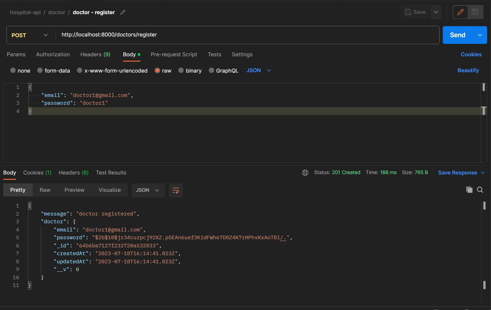
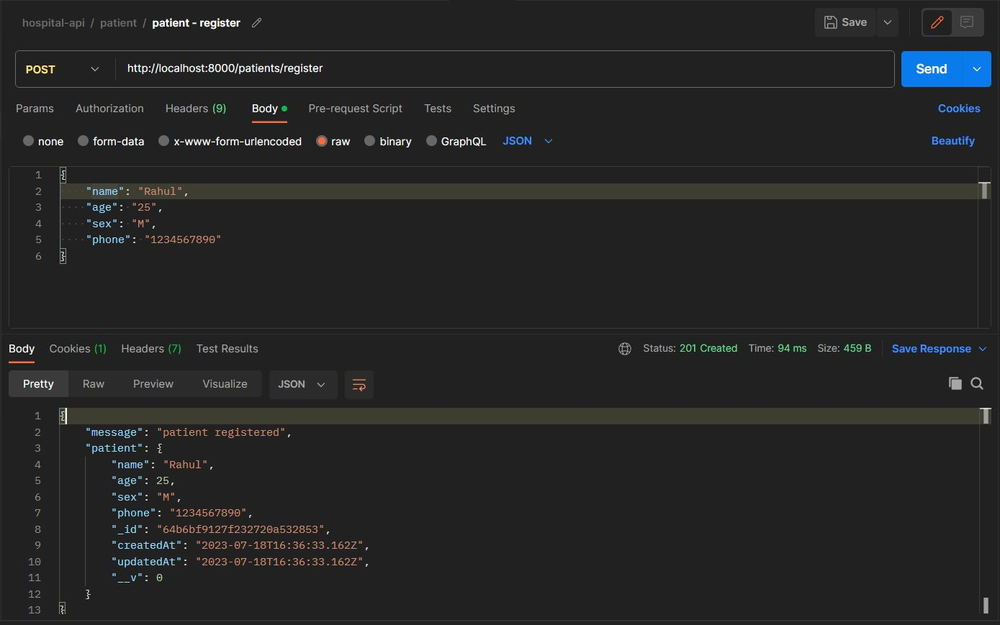
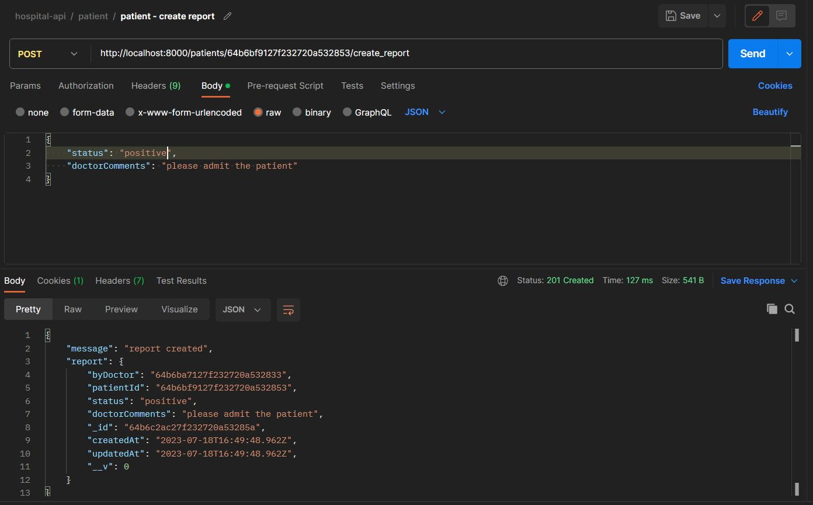
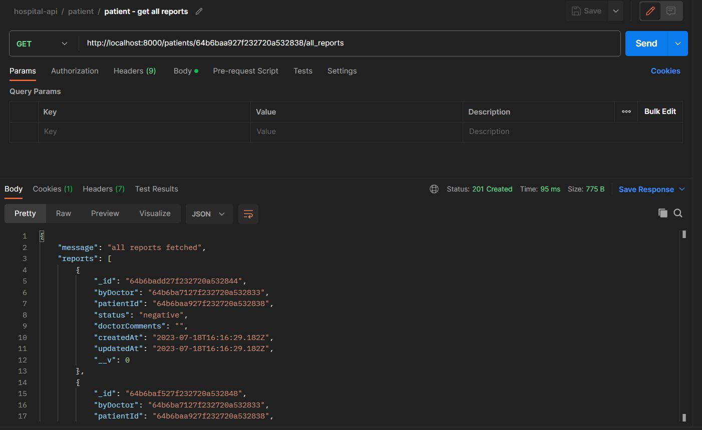
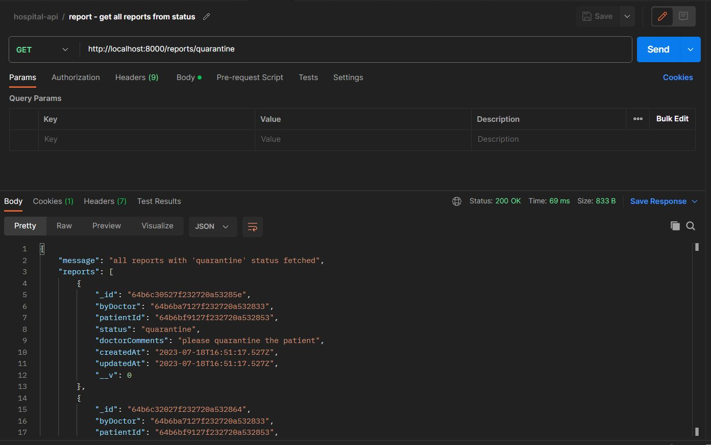

# Hospital API Project

Live base url --> https://sleepy-tank-top-wasp.cyclic.app<br>
Please import hosted postman collection from the postmanCollection folder to consume the API from your local machine.





- This is an API which is designed for the doctors of a hospital which has been allocated by the
  govt for testing, quarantine and treatment of COVID-19 patients<br>
- There can be two types of users Doctors and Patients.<br>
- Doctors can register and log in.<br>
- After logging in, doctors can register the patients using a phone number. If the patient phone number is already registered then the API will return the the existing patient information.<br>
- After registering the patient, using the patient id, doctor can create a report of the patient by passing in two fields, doctorComments and status of the patient. Here status means the covid status which is denoted by the following enum fields: 'negative', 'postive', 'quarantine'.
- Doctors can get all the reports of the patient by consuming /all_reports endpoint<br>
- Doctors can also delete the patient information and associated reports using the /delete endpoint.<br>







## Tech Stack

- this project uses Express.js as a back end web application framework for building this API with Node.js<br>
- jsonwebtoken is used for authentication of routes<br>
- bcrypt library is used for hasing the password before saving it to the database<br>
- cookie-parser library is used to parse the incoming cookies<br>
- jsonwebtoken is used for authentication of routes<br>
- for database configuration, this project uses MongoDB<br>

## Local Machine Setup

To run this API in your local machine, please follow the below steps. Your machine should have MongoDB setup as this application uses MongoDB for database needs.

1 - Clone the repository using the following command

```
git clone https://github.com/vibhavk03/hospital-api.git
```

2 - Install the required dependencies using the following command

```
npm install
```

3 - Start the server using the following command

```
npm run start
```

If want to start using nodemon run the following command

```
npm run dev
```

4 - Import the postman collection provided in the API and consume the API from there
